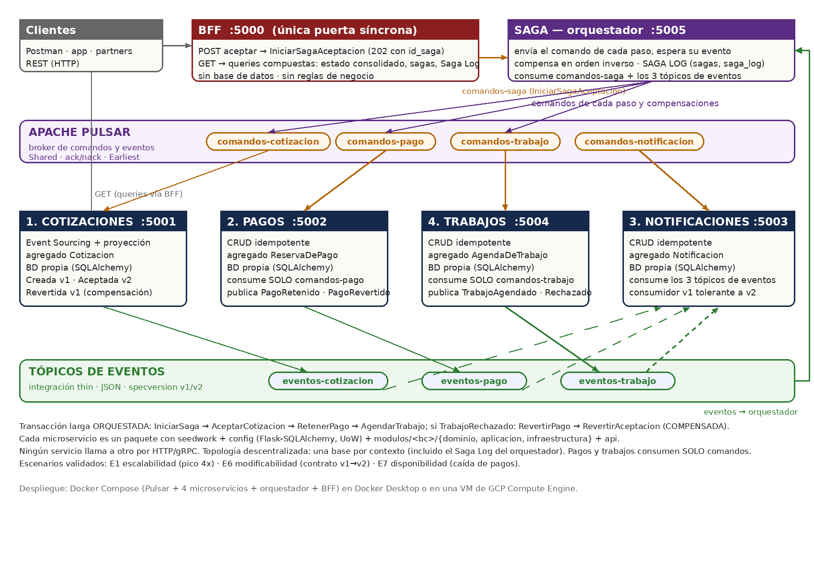

# Hogar de los Alpes — POC de arquitectura de microservicios basada en eventos

**MISO · Diseño y construcción de soluciones no monolíticas · Entrega 5**
**Equipo HdA:** Sergio Fernando Barrera Molano (202517034) · Harold Andres Bartolo Moscoso (202513889) · Juan Jose Restrepo Bonilla (202516633)

Prueba de concepto de la arquitectura objetivo de Hogar de los Alpes (HdA): **4 microservicios**
que se comunican **exclusivamente por comandos y eventos sobre Apache Pulsar**, una **saga
orquestada** con **Saga Log** que coordina la transacción larga *aceptar cotización* (con
compensaciones), un **BFF** REST como única puerta síncrona para clientes, topología de datos
**descentralizada**, **Event Sourcing** en el núcleo y **CRUD idempotente** en el resto, y la
validación ejecutable de **3 escenarios de calidad** (uno por atributo priorizado) con resultados
cuantitativos y un refinamiento de la arquitectura derivado de ellos.

| Documento | Para qué |
|---|---|
| **README.md** (este) | Qué es, cómo levantarlo, cómo probarlo con Postman, dónde está cada cosa |
| [`README-GCP.md`](README-GCP.md) | Montarlo y probarlo en Google Cloud paso a paso |
| [`docs/SAGA.md`](docs/SAGA.md) · [PDF](Entrega5-Saga-y-SagaLog.pdf) | La saga orquestada: justificación, agregado Saga, **Saga Log**, consultas SQL, cómo demostrarla |
| [`docs/RESULTADOS-EXPERIMENTACION.md`](docs/RESULTADOS-EXPERIMENTACION.md) · [PDF](Entrega5-Resultados-Experimentacion.pdf) | **Resultados cuantitativos y cualitativos** de E1/E6/E7 e hipótesis (cumplidas o no) |
| [`docs/REFINAMIENTO-ARQUITECTURA.md`](docs/REFINAMIENTO-ARQUITECTURA.md) · [PDF](Entrega5-Refinamiento-Arquitectura.pdf) | **Refinamiento** del mapa de contexto TO-BE (E1) y de las vistas (E2) con cambios justificados; diagramas en `docs/img/` |
| [`docs/ESCENARIOS.md`](docs/ESCENARIOS.md) | Los 3 escenarios de calidad: diseño, cómo se corren, salidas |
| [`docs/API-BFF.md`](docs/API-BFF.md) | Referencia de los endpoints del BFF y de las queries de cada servicio |
| [`docs/DECISIONES.md`](docs/DECISIONES.md) | Decisiones de arquitectura: topología, ES vs CRUD, eventos, esquemas, saga, DDD, despliegue |
| [`Entrega4-HogarDeLosAlpes-Criterios.pdf`](Entrega4-HogarDeLosAlpes-Criterios.pdf) | Cumplimiento criterio por criterio de la Entrega 4 (base de esta) |
| [`postman/`](postman/) | Collection de Postman del BFF (saga exitosa, con compensación, monitoreo) + environments `local` y `gcp` |

---

## 1. Arquitectura en una imagen



```
             Postman / app / partners
                      │  HTTP (REST)
                      ▼
            ┌──────────────────┐   POST → publica COMANDOS a Pulsar y responde 202
            │   BFF  (:5000)   │   GET  → queries síncronas a los servicios (compone vistas)
            └────────┬─────────┘
                     │ comandos-saga (IniciarSagaAceptacion)
                     ▼
            ┌───────────────────────────┐   envía comandos a cada paso, espera su evento,
            │ SAGA — orquestador (:5005)│   compensa en orden inverso; SAGA LOG en su BD
            └───────────────────────────┘
    comandos-cotizacion │  comandos-pago │  comandos-trabajo        (tópicos de COMANDOS, uno por servicio)
                        ▼               ▼               ▼
 ┌──────────────────┐   ┌──────────────┐   ┌──────────────┐        ┌───────────────────┐
 │ COTIZACIONES     │   │ PAGOS        │   │ TRABAJOS     │        │ NOTIFICACIONES    │
 │ :5001            │   │ :5002        │   │ :5004        │        │ :5003             │
 │ Event Sourcing   │   │ CRUD idemp.  │   │ CRUD idemp.  │        │ CRUD idemp.       │
 │ Aceptar/Revertir │   │ Retener/     │   │ Agendar →    │        │ consume los 3     │
 │ BD propia        │   │ Revertir     │   │ Agendado |   │        │ tópicos de eventos│
 └────────┬─────────┘   └──────┬───────┘   │ Rechazado    │        └─────────▲─────────┘
          │ eventos-cotizacion │ eventos-pago └──────┬───────┘ eventos-trabajo │
          └────────────────────┴──────────────────────┴──────────────────────┘
                     (tópicos de EVENTOS: los consume el orquestador y notificaciones)
```

**La transacción larga de la POC:** *aceptar una cotización* = aceptar → retener el pago
(escrow) → agendar el trabajo. La coordina el **orquestador de sagas**; si el trabajo no puede
agendarse (proveedor sin disponibilidad), la saga **compensa**: libera el pago y revierte la
aceptación. Cada servicio es un contexto acotado con su modelo, su base de datos y su tópico de
comandos; entre servicios **no existe ningún llamado HTTP ni gRPC**.

| Servicio | Puerto | Modelo de datos | Consume | Publica |
|---|---|---|---|---|
| **BFF** | 5000 | — (sin BD, sin reglas) | HTTP de clientes | `IniciarSagaAceptacion` → `comandos-saga`; comandos directos a los demás tópicos |
| **Saga (orquestador)** | 5005 | CRUD + **Saga Log** | `comandos-saga` + los 3 tópicos de eventos | comandos de cada paso y de compensación a `comandos-cotizacion` / `-pago` / `-trabajo` |
| **Cotizaciones** | 5001 | Event Sourcing + proyección | `comandos-cotizacion` | `CotizacionCreada` v1, `CotizacionAceptada` v2, `CotizacionRevertida` v1 → `eventos-cotizacion` |
| **Pagos** | 5002 | CRUD idempotente | `comandos-pago` (solo comandos) | `PagoRetenido` v1, `PagoRevertido` v1 → `eventos-pago` |
| **Trabajos** | 5004 | CRUD idempotente | `comandos-trabajo` (solo comandos) | `TrabajoAgendado` v1, `TrabajoRechazado` v1 → `eventos-trabajo` |
| **Notificaciones** | 5003 | CRUD idempotente | `comandos-notificacion` + los 3 tópicos de eventos | — (consumidor final) |
| **Apache Pulsar** | 6650 / 8080 | broker de comandos y eventos | | |

---

## 2. La saga orquestada y el Saga Log (Entrega 5)

`POST /bff/cotizaciones/{id}/aceptar` inicia la transacción larga. El orquestador (`servicios/saga`)
envía `AceptarCotizacion` → `RetenerPago` → `AgendarTrabajo`, esperando el evento de cada paso, y
registra **cada transición en el Saga Log** (`saga_log`: INICIO, COMANDO_ENVIADO, EVENTO_RECIBIDO,
PASO_OK/PASO_FALLIDO, COMPENSACION_ENVIADA/OK, FIN). Si trabajos responde `TrabajoRechazado`, compensa
en orden inverso (`RevertirPago` → `RevertirAceptacion`) hasta `COMPENSADA`.

| | Exitosa (proveedor `PRV-7`) | Con fallo y compensación (proveedor `PRV-SIN-CUPO`) |
|---|---|---|
| Estado final de la saga | `COMPLETADA` (11 entradas de log) | `COMPENSADA` (17 entradas; motivo registrado) |
| Cotización · pago · trabajo | ACEPTADA · RETENIDO · AGENDADO | EMITIDA (v3, `CotizacionRevertida` en su historia) · LIBERADO · RECHAZADO |

Demostración en 1 comando: `bash escenarios/probar_saga.sh` (o Postman, carpetas 1 y 2). Monitoreo:
`GET /bff/sagas`, `GET /bff/sagas/{id}/log`, o con SQL sobre la base del orquestador:
```bash
docker compose exec saga sqlite3 -header -column /app/src/saga/api/saga.db \
  "SELECT estado, COUNT(*) FROM sagas GROUP BY estado;"
docker compose exec saga sqlite3 -header -column /app/src/saga/api/saga.db \
  "SELECT secuencia, tipo, paso, servicio, mensaje FROM saga_log WHERE id_saga='<id>' ORDER BY secuencia;"
```
Por qué orquestación (y no coreografía), el modelo del agregado `Saga` y más consultas SQL:
[`docs/SAGA.md`](docs/SAGA.md).

---

## 3. Los 3 escenarios de calidad que se prueban

Uno por cada atributo priorizado en la Entrega 2, tomados de los 9 de la Entrega 3
(detalle, comandos y salidas reales en [`docs/ESCENARIOS.md`](docs/ESCENARIOS.md)):

| # | Atributo | Escenario | Qué se verifica |
|---|---|---|---|
| **E1** | Escalabilidad | Pico climático 4x en 48 h | Ráfaga de N transacciones largas: 0 rechazos, drenaje end-to-end, reservas y sagas exactas N/N; throughput y tiempo de drenaje medidos (N = 30 / 300 / 1.000) |
| **E6** | Modificabilidad | Evolución del contrato de eventos v1 → v2 | El productor publica `CotizacionAceptada` v2 (campo `pais`); un consumidor escrito contra v1 procesa v1 y v2 sin romperse; downtime 0 |
| **E7** | Disponibilidad (**crítico**) | Caída de la pasarela de pagos 30 min | Se mata pagos con transacciones en curso: el núcleo sigue 100 % (sondas), los comandos quedan retenidos en Pulsar, al volver todas las sagas terminan COMPLETADAS (RPO = 0, RTO medido) y 5 re-entregas inyectadas producen 0 duplicados |

Última validación integrada: **E1 = CUMPLIDO · E6 = CUMPLIDO · E7 = CUMPLIDO** (E1 con 1.000 transacciones: 0 rechazos,
drenaje lineal a ~37 tx/s por réplica; E7 con 50: RTO 1,1 s, 50/50 sagas completadas). Hipótesis, tablas y conclusiones en
[`docs/RESULTADOS-EXPERIMENTACION.md`](docs/RESULTADOS-EXPERIMENTACION.md).

---

## 4. Cómo levantar el sistema

### Modo A — Docker + Apache Pulsar (entrega oficial; Windows, Mac, Linux)

Requisito: Docker Desktop (o Docker Engine + Compose v2). Todo corre en contenedores,
incluidos los escenarios (`pulsar-client` de Python no tiene wheels para Windows).

```bash
docker compose up --build -d          # Pulsar + 4 microservicios + orquestador + BFF (1ª vez: descarga Pulsar ~560 MB)
curl localhost:5000/bff/health        # {"bff":"up","cotizaciones":"up","pagos":"up","trabajos":"up","notificaciones":"up","saga":"up"}
```

Ver logs en vivo (útil durante la demo y los escenarios):
```bash
docker compose logs -f saga cotizaciones pagos trabajos notificaciones bff | grep -E "\[saga\]|\[cotizaciones\]|\[pagos\]|\[trabajos\]|\[notificaciones\]|\[bff\]"
```

Apagar: `docker compose down -v`.

### Modo B — sin Docker (adaptador de archivos, mismo código)

El broker es un **puerto** con dos adaptadores: `pulsar` y `archivo`. El modo B corre los 5
procesos localmente sin infraestructura (Linux/Mac/WSL; requiere Python 3.11+):

```bash
pip install flask flask-sqlalchemy sqlalchemy PyDispatcher
bash escenarios/validar_todo.sh       # levanta los 4 servicios + saga + BFF, corre E1+E6+E7 y apaga todo
```

O manualmente, una terminal por proceso desde la raíz del repo:
```bash
export BROKER=archivo BROKER_DIR=$PWD/broker_dev
cd servicios/cotizaciones   && PYTHONPATH=src python src/cotizaciones/main.py    # :5001
cd servicios/pagos          && PYTHONPATH=src python src/pagos/main.py           # :5002
cd servicios/notificaciones && PYTHONPATH=src python src/notificaciones/main.py  # :5003
cd servicios/trabajos       && PYTHONPATH=src python src/trabajos/main.py        # :5004
cd servicios/saga           && PYTHONPATH=src python src/saga/main.py            # :5005
cd servicios/bff            && PYTHONPATH=src python src/bff/main.py             # :5000
```

### En Google Cloud

Paso a paso en [`README-GCP.md`](README-GCP.md) (VM de Compute Engine + Docker Compose; ~15 minutos).

---

## 5. Cómo probar con Postman (a través del BFF)

1. Importar en Postman `postman/HogarDeLosAlpes-BFF.postman_collection.json` y el environment
   `postman/HdA-local.postman_environment.json` (o `HdA-gcp` con la IP de la VM).
2. Seleccionar el environment y ejecutar con el *Collection Runner* las carpetas **`1`** y **`2`** (o
   request por request, en orden). Cada request guarda variables (`id_cotizacion`, `id_saga`, …) que
   usan las siguientes, e incluye *tests* que verifican el resultado.

Qué hace la collection (28 requests, 69 aserciones):

| Carpeta | Contenido |
|---|---|
| `0. Salud` | health del BFF, los 4 servicios y el orquestador; stats |
| `1. Transacción larga EXITOSA` | crear (202) → consultar → **aceptar = iniciar saga** (202 con `id_saga`) → estado de la saga `COMPLETADA` → **Saga Log** (11 entradas) → estado consolidado (`TRABAJO_AGENDADO`) → historia event-sourced |
| `2. Transacción con FALLO y COMPENSACIÓN` | crear con `PRV-SIN-CUPO` → aceptar → saga `COMPENSADA` con motivo → **Saga Log con compensaciones en orden inverso** → estado consistente (EMITIDA · LIBERADO · RECHAZADO) → historia con `CotizacionRevertida` |
| `3. Monitoreo de sagas` | todas las sagas y conteo por estado, últimas entradas del log, búsqueda por id de cotización |
| `4. Consultas por servicio` | reservas, trabajos, notificaciones |
| `5. Comandos directos` | `RetenerPago`, `AgendarTrabajo` a sus tópicos (lo mismo que hace el orquestador) |
| `6. Validaciones y errores` | 400 por campos faltantes, 404 inexistente, comando rechazado por regla del dominio |

**Semántica importante:** un `POST` responde **`202 Accepted`** — el comando fue publicado al
tópico, no ejecutado. El efecto se ve en los `GET` después de ~1-2 s (CQS + consistencia
eventual); los pre-request de la collection ya esperan. Un comando puede ser **rechazado** por una
regla del dominio aunque el BFF haya respondido 202 (p. ej. aceptar dos veces): se ve en los logs
del servicio y en que la proyección no cambia.

Ejemplo con `curl`:
```bash
ID=$(curl -s -X POST localhost:5000/bff/cotizaciones -H 'Content-Type: application/json' \
  -d '{"id_trabajo":"TRB-001","id_proveedor":"PRV-7","monto":220000,"moneda":"MXN","pais":"MX"}' \
  | python -c 'import sys,json;print(json.load(sys.stdin)["id"])')
SAGA=$(curl -s -X POST localhost:5000/bff/cotizaciones/$ID/aceptar | python -c 'import sys,json;print(json.load(sys.stdin)["id_saga"])')
sleep 3; curl -s localhost:5000/bff/sagas/$SAGA/log                  # Saga Log: INICIO … FIN COMPLETADA
curl -s localhost:5000/bff/cotizaciones/$ID/estado                 # fase: TRABAJO_AGENDADO
```

Referencia completa de endpoints en [`docs/API-BFF.md`](docs/API-BFF.md). La collection también
se puede correr sin interfaz con `newman run postman/HogarDeLosAlpes-BFF.postman_collection.json -e postman/HdA-local.postman_environment.json --delay-request 1800`.

---

## 6. Cómo correr los escenarios de calidad

```bash
# Modo A (Docker + Pulsar)
docker compose build escenarios                                              # una vez
docker compose run --rm escenarios python traza_unica.py                     # UNA traza de punta a punta + Saga Log (demo)
bash escenarios/probar_saga.sh                                               # saga exitosa + saga compensada (demo)
docker compose run --rm escenarios python escenario_e1_escalabilidad.py      # E1  (opcional: -e N=2000)
docker compose run --rm escenarios python escenario_e6_modificabilidad.py    # E6
bash escenarios/e7_docker.sh                                                 # E7 (para/arranca pagos por fases)

# Modo B (sin Docker)
bash escenarios/validar_todo.sh
```

Cada escenario termina en `CUMPLIDO` o `FALLIDO` con sus mediciones. Detalle en
[`docs/ESCENARIOS.md`](docs/ESCENARIOS.md).

---

## 7. Estructura del proyecto

```
entrega4-hogar-de-los-alpes/
├── README.md · README-GCP.md · docker-compose.yml · .gitignore
├── arquitectura.png · Entrega4-HogarDeLosAlpes-Criterios.pdf
├── Entrega5-Saga-y-SagaLog.pdf · Entrega5-Resultados-Experimentacion.pdf · Entrega5-Refinamiento-Arquitectura.pdf
├── docs/
│   ├── SAGA.md                        # saga orquestada, Saga Log, consultas SQL
│   ├── RESULTADOS-EXPERIMENTACION.md  # resultados cuantitativos/cualitativos e hipótesis
│   ├── REFINAMIENTO-ARQUITECTURA.md   # refinamiento de E1/E2 con cambios justificados
│   ├── img/R1..R5-*.png               # mapa de contexto y vistas refinadas (cambios Δn en ámbar)
│   ├── ESCENARIOS.md · API-BFF.md · DECISIONES.md
├── postman/
│   ├── HogarDeLosAlpes-BFF.postman_collection.json
│   ├── HdA-local.postman_environment.json · HdA-gcp.postman_environment.json
│   └── generar_collection.py  # la collection se genera desde aquí (fuente única)
├── gcp/instalar-vm.sh         # instala Docker y levanta todo en una VM de GCP
├── servicios/
│   ├── bff/                   # REST → comandos a Pulsar (POST) · queries compuestas (GET)
│   │   └── src/bff/{api, infraestructura/{broker.py, contratos.py}, main.py}
│   ├── saga/                  # ORQUESTADOR: agregado Saga, SAGA LOG (sagas, saga_log), consume comandos-saga + eventos
│   ├── cotizaciones/          # Event Sourcing + proyección · comandos-cotizacion · eventos-cotizacion
│   ├── pagos/                 # CRUD idempotente · comandos-pago · eventos-pago
│   ├── trabajos/              # CRUD idempotente · comandos-trabajo · eventos-trabajo
│   └── notificaciones/        # CRUD idempotente · comandos-notificacion · consume 3 tópicos
│       (cada microservicio: Dockerfile · requirements.txt · src/<servicio>/
│         seedwork/            base DDD del tutorial 7: Entidad, AgregacionRaiz, EventoDominio, ObjetoValor,
│                              ReglaNegocio, Fabrica, Repositorio (puerto), Comando/Query, UnidadTrabajo, broker (puerto)
│         config/              db.py (Flask-SQLAlchemy) · uow.py (UnidadTrabajoSQLAlchemy)
│         modulos/<bc>/
│           dominio/           entidades · objetos_valor · eventos · reglas · fabricas · repositorios · excepciones
│           aplicacion/        comandos/ · queries/ · dto · mapeadores · handlers
│           infraestructura/   dto (modelos SQLAlchemy) · repositorios · mapeadores · fabricas ·
│                              despachadores · consumidores · schema/v1 (v2)
│         api/                 blueprint Flask (solo queries) · create_app
│         main.py)
└── escenarios/
    ├── probar_saga.sh (saga exitosa + compensada) · traza_unica.py
    ├── escenario_e1_escalabilidad.py · escenario_e6_modificabilidad.py · escenario_e7_disponibilidad.py
    ├── validar_todo.sh (modo B) · e7_docker.sh (E7 en Docker) · Dockerfile (cliente de escenarios) · comun.py · contratos.py
```

---

## 8. Resumen de decisiones (detalle en `docs/DECISIONES.md`)

- **Comunicación:** solo comandos y eventos por Pulsar; un tópico de comandos por servicio; los GET son para clientes. Suscripciones `Shared`, `ack` tras aplicar el efecto, `nack` para reintento, `Earliest`.
- **Topología de datos descentralizada:** una BD por contexto acotado; solo se comparte el contrato de mensajes. Sin joins entre servicios; consistencia eventual — el tradeoff que el árbol de utilidad de la Entrega 2 permitió.
- **Event Sourcing** en cotizaciones (dinero, auditoría, replay; con proyección para consultas) y **CRUD idempotente** en pagos, trabajos y notificaciones (marca del mensaje en la misma transacción que el efecto).
- **Eventos de integración thin, JSON, versionados en el envelope** (`specversion`) con política **BACKWARD**; v1 y v2 conviven en el mismo tópico (E6).
- **Saga orquestada** (no coreografía): el estado y el log de cada transacción viven en un contexto propio (`saga`) con base propia; los servicios de la cadena consumen solo comandos y responden con eventos; las compensaciones son acciones de negocio en orden inverso. Notificaciones sigue en coreografía (no participa en la transacción).
- **BFF** como única puerta síncrona: publica comandos (iniciar saga), compone queries, no tiene BD ni reglas.
- **DDD:** contextos acotados = servicios; agregados con raíz, objetos valor, reglas, fábricas; capas cebolla; inversión de dependencias (repositorios y broker como puertos); Unidad de Trabajo del tutorial 7.
- **Despliegue:** un contenedor por servicio + Pulsar con Docker Compose, en Docker Desktop o en una VM de GCP (`README-GCP.md`); mismas imágenes para pasar a GKE.

---

## 9. Actividades por miembro

| Miembro | Actividades |
|---|---|
| Sergio Fernando Barrera Molano | _completar_ |
| Harold Andres Bartolo Moscoso | _completar_ |
| Juan Jose Restrepo Bonilla | _completar_ |
