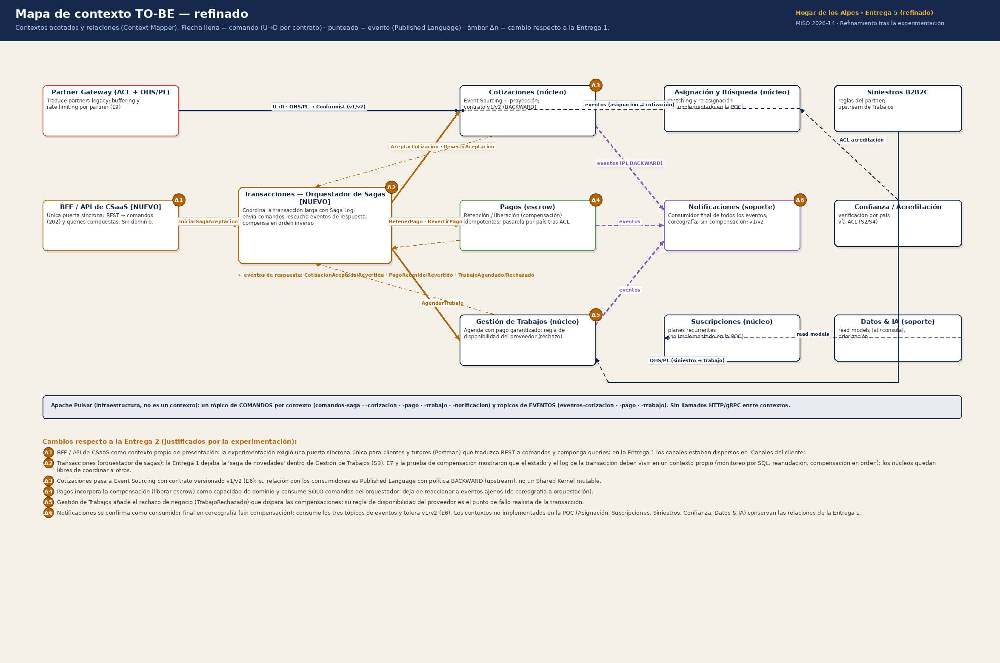
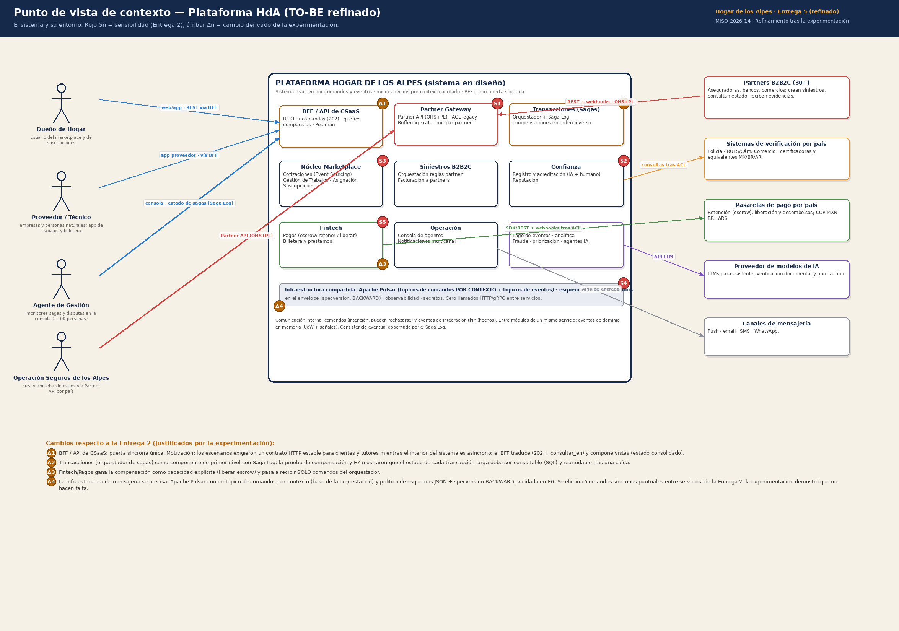
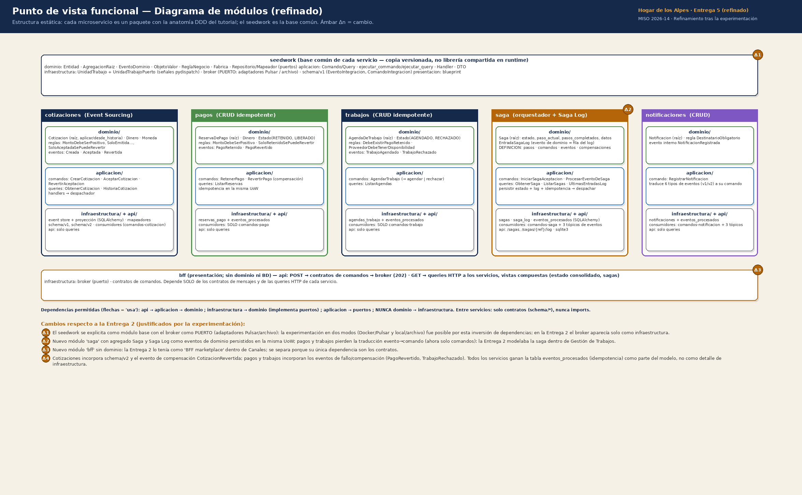
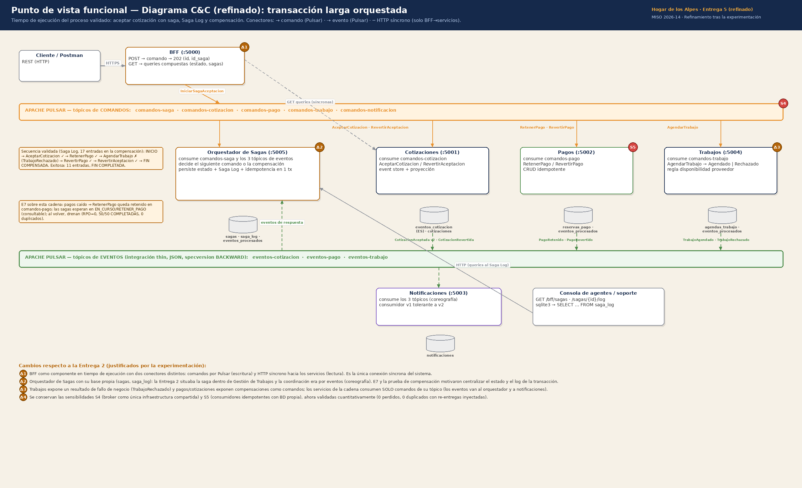
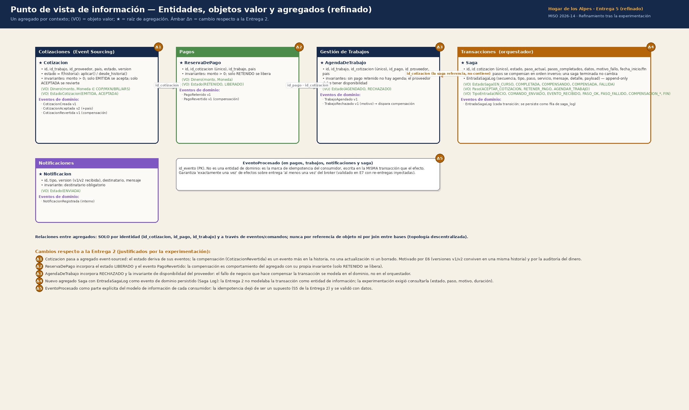

# Refinamiento de la arquitectura tras la experimentación

**Entrega 5 · Equipo HdA.** Este documento refina el **mapa de contexto TO-BE de la Entrega 1** y
los **puntos de vista de la Entrega 2** (contexto, funcional-módulos, funcional-C&C, información)
con base en los resultados y conclusiones de la experimentación
(`docs/RESULTADOS-EXPERIMENTACION.md`). Cada diagrama refinado marca los cambios con etiquetas
ámbar **Δn** y los justifica en su leyenda; aquí se consolidan y se explica la trazabilidad
resultado → cambio.

Diagramas (en `docs/img/`):

| Diagrama | Refina | Archivo |
|---|---|---|
| R1 | Mapa de contexto TO-BE (Entrega 1) | `R1-mapa-contexto-refinado.png` |
| R2 | Punto de vista de contexto (Entrega 2) | `R2-vista-contexto-refinada.png` |
| R3 | Punto de vista funcional — módulos (Entrega 2) | `R3-vista-modulos-refinada.png` |
| R4 | Punto de vista funcional — C&C (Entrega 2) | `R4-vista-cyc-refinada.png` |
| R5 | Punto de vista de información (Entrega 2) | `R5-vista-informacion-refinada.png` |

---

## 1. Qué aprendimos y qué cambió

| Resultado de la experimentación | Conclusión | Cambio arquitectónico |
|---|---|---|
| E7: con pagos caído, el núcleo siguió al 100 % y las transacciones quedaron **esperando** en un paso concreto; al volver, drenaron 50/50 | El estado de una transacción larga es información de negocio que hay que **poder consultar** durante un incidente | Nuevo contexto **Transacciones (orquestador de sagas)** con **Saga Log** consultable por API y SQL (R1-Δ2, R2-Δ2, R3-Δ2, R4-Δ2, R5-Δ4) |
| Prueba de compensación: un fallo de negocio en el paso 3 exigió deshacer los pasos 1 y 2 **en orden inverso** (liberar escrow antes de revertir la aceptación) | Las compensaciones tienen orden y dependencias; en coreografía cada servicio tendría que conocer los demás | **Orquestación** en lugar de la coreografía implícita de la Entrega 2; pagos y trabajos consumen **solo comandos** (R1-Δ4, R4-Δ3) |
| E6: v1 y v2 convivieron en el mismo tópico sin romper consumidores; en la Entrega 5 el contrato volvió a evolucionar (6 tipos de mensaje nuevos) sin romper nada | La relación entre productores y consumidores es un **Published Language** versionado, no un Shared Kernel que se coordina | Cotizaciones → Event Sourcing + contrato v1/v2 BACKWARD; el mapa de contexto etiqueta las relaciones como PL/Conformist (R1-Δ3, R5-Δ1) |
| E1: throughput de drenaje constante por réplica (37 tx/s) y lineal con N; publicación 1.300× más rápida que el drenaje | El broker absorbe; la capacidad se agrega con réplicas de consumidores idempotentes | Se conservan S4 y S5 de la Entrega 2, ahora **validadas**; idempotencia (`EventoProcesado`) pasa al modelo de información (R5-Δ5, R4-Δ4) |
| Los tutores y clientes necesitan un contrato HTTP estable (Postman) mientras el interior es asíncrono | Hace falta una **puerta síncrona única** que traduzca y componga | Nuevo contexto **BFF / API de CSaaS** (R1-Δ1, R2-Δ1, R3-Δ3, R4-Δ1) |
| Ningún escenario necesitó llamados síncronos entre servicios; el único intento (trabajos → cotizaciones) se eliminó enriqueciendo el evento | Los "comandos síncronos puntuales" de la Entrega 2 eran innecesarios | Se **eliminan** de la vista de contexto; la infraestructura se precisa como un tópico de comandos por contexto (R2-Δ4) |
| El fallo realista de la transacción es de **negocio** (proveedor sin disponibilidad), no técnico | Los puntos de fallo deben modelarse como invariantes del dominio que emiten eventos de rechazo | Gestión de Trabajos incorpora `TrabajoRechazado` y la regla de disponibilidad (R1-Δ5, R5-Δ3); Pagos incorpora `LIBERADO`/`PagoRevertido` (R5-Δ2) |

---

## 2. Mapa de contexto TO-BE refinado (R1)

**Qué se mantiene de la Entrega 1.** Los dominios y subdominios (núcleo: Cotizaciones, Gestión
de Trabajos, Asignación y Búsqueda, Suscripciones; soporte: Notificaciones, Confianza, Datos & IA;
integración: Partner Gateway, Siniestros B2B2C) y la dirección de las relaciones con partners
(HdA upstream con OHS+PL; ACL para legacy) — la corrección que dejó el feedback de la Entrega 1.

**Qué cambia y por qué.**

- **Δ1 — BFF / API de CSaaS** como contexto de presentación. En la Entrega 1 los canales eran un
  subdominio genérico ("Canales del cliente"). La experimentación necesitó un componente que
  exponga capacidades de negocio por REST, publique comandos y **componga** vistas (estado
  consolidado, sagas). No tiene dominio propio: depende solo de contratos y de las queries HTTP.
- **Δ2 — Transacciones (orquestador de sagas)**. La Entrega 1 (y el punto S3 de la Entrega 2)
  situaba la saga *dentro* de Gestión de Trabajos. E7 y la prueba de compensación mostraron que
  (a) el estado de la transacción debe ser consultable y reanudable por sí mismo, (b) un núcleo
  no debería coordinar a otros núcleos. Es un contexto de soporte con su agregado `Saga` y su
  base propia; es **upstream por contrato de comandos** de cotizaciones, pagos y trabajos, y
  **downstream** de sus eventos.
- **Δ3 — Cotizaciones** pasa a Event Sourcing con contrato versionado (v1/v2, BACKWARD). Su
  relación con consumidores se etiqueta como Published Language (upstream); Partner Gateway es
  *Conformist* de ese contrato.
- **Δ4 — Pagos** y **Δ5 — Gestión de Trabajos** incorporan compensación y rechazo como
  capacidades del dominio, y consumen únicamente comandos (orquestación).
- **Δ6 — Notificaciones** se confirma como consumidor final en coreografía: no participa en la
  transacción, no tiene compensación, y tolera v1/v2.

Los contextos no implementados en la POC conservan sus relaciones de la Entrega 1 (Siniestros
→ Trabajos vía OHS/PL; Confianza → Asignación vía ACL; Datos & IA → read models).

---

## 3. Punto de vista de contexto refinado (R2)

Se conservan los actores, los sistemas externos y los puntos de sensibilidad S1-S5 de la Entrega
2 (siguen siendo válidos y tres de ellos — S3 saga, S4 broker, S5 idempotencia — quedaron
validados con datos). Cambios:

- **Δ1** BFF como componente de primer nivel dentro del sistema; los actores humanos entran por
  él (web/app, app del proveedor, consola).
- **Δ2** Transacciones (Sagas) como componente de primer nivel con Saga Log; la consola de
  agentes lo consulta (*estado de sagas*).
- **Δ3** Fintech/Pagos gana la compensación (retener / liberar) y recibe solo comandos.
- **Δ4** La infraestructura compartida se precisa: Apache Pulsar con **un tópico de comandos por
  contexto** más tópicos de eventos; esquemas JSON con `specversion` y política BACKWARD. Se
  **elimina** el texto de la Entrega 2 "comandos síncronos puntuales entre servicios del mismo
  flujo": la experimentación demostró que no hacen falta (cero llamados HTTP/gRPC entre servicios).

---

## 4. Punto de vista funcional — módulos refinado (R3)

La Entrega 2 mostraba los módulos por dominio. El refinamiento muestra la **anatomía real** que
la experimentación consolidó: cada microservicio es un paquete `seedwork + config + modulos/<bc>/
{dominio, aplicacion, infraestructura} + api`, con las dependencias permitidas (api → aplicación
→ dominio; infraestructura implementa los puertos del dominio; nunca dominio → infraestructura;
entre servicios solo contratos).

- **Δ1** El seedwork se explicita como base común y el **broker como puerto** con dos adaptadores
  (Pulsar / archivo). Sin esta inversión de dependencias no habría sido posible experimentar en
  dos modos (Docker/Pulsar y local) con el mismo código.
- **Δ2** Nuevo módulo `saga` (agregado `Saga`, `EntradaSagaLog` como evento de dominio persistido
  en la misma UoW). Pagos y trabajos pierden la traducción evento→comando.
- **Δ3** Nuevo módulo `bff` sin dominio ni BD (la Entrega 2 lo tenía dentro de Canales).
- **Δ4** Cotizaciones incorpora `schema/v2` y `CotizacionRevertida`; pagos y trabajos incorporan
  los eventos de compensación/rechazo; todos los consumidores ganan `eventos_procesados`.

---

## 5. Punto de vista funcional — C&C refinado (R4)

La Entrega 2 modelaba el proceso "pico de siniestros 4x mientras un trabajo reporta una novedad".
El refinamiento modela el **proceso que efectivamente se validó**: la transacción larga *aceptar
cotización* con orquestación, Saga Log y compensación, en tiempo de ejecución, con conectores
tipados (→ comando por Pulsar, ⇢ evento por Pulsar, ─ HTTP síncrono solo del BFF hacia los
servicios).

- **Δ1** BFF con dos conectores distintos (comandos para escribir, HTTP para leer): la única
  conexión síncrona del sistema.
- **Δ2** Orquestador con base propia (`sagas`, `saga_log`); la saga de la Entrega 2 vivía en
  Gestión de Trabajos y se coordinaba por eventos.
- **Δ3** Trabajos expone `TrabajoRechazado`; pagos y cotizaciones exponen compensaciones como
  comandos; los servicios de la cadena consumen solo comandos de su tópico.
- **Δ4** S4 y S5 se conservan, validados cuantitativamente (0 perdidos, 0 duplicados con
  re-entregas inyectadas). Las notas del diagrama recogen la secuencia observada en el Saga Log
  (11 entradas exitosa / 17 compensada) y el comportamiento de E7 sobre esta cadena.

---

## 6. Punto de vista de información refinado (R5)

La Entrega 2 mostró las entidades, objetos valor y agregados del dominio completo. El
refinamiento detalla los agregados **implementados y validados** y agrega los que la
experimentación hizo necesarios:

- **Δ1** `Cotizacion` como agregado event-sourced (el estado deriva de sus eventos;
  `CotizacionRevertida` es un evento más, nunca un borrado). Motivado por E6 (versiones distintas
  conviven en una historia) y por la auditoría del dinero.
- **Δ2** `ReservaDePago` con estado `LIBERADO` y evento `PagoRevertido` (la compensación es
  comportamiento del agregado con su invariante).
- **Δ3** `AgendaDeTrabajo` con `RECHAZADO`, `TrabajoRechazado` y la invariante de disponibilidad
  del proveedor: el fallo de negocio se modela en el dominio, no en el orquestador.
- **Δ4** Nuevo agregado `Saga` con `EntradaSagaLog` (Saga Log) y sus objetos valor
  (`EstadoSaga`, `Paso`, `TipoEntrada`). La Entrega 2 no modelaba la transacción como
  información; la experimentación exigió consultarla (estado, paso, motivo, duración).
- **Δ5** `EventoProcesado` como parte explícita del modelo de cada consumidor: la idempotencia
  dejó de ser un supuesto (S5) y se validó.

Las relaciones entre agregados siguen siendo **solo por identidad** (`id_cotizacion`, `id_pago`,
`id_trabajo`) a través de comandos y eventos — nunca por join entre bases (topología
descentralizada), y la saga *referencia* la cotización, no la contiene.

---

## 7. Lo que NO cambió, y por qué

- Los **tres atributos de calidad** y el árbol de utilidad de la Entrega 2: los resultados los
  confirman, incluidos los sacrificios previstos (latencia de operación, consistencia inmediata,
  simplicidad operativa).
- La **topología descentralizada** y el broker como única infraestructura compartida (S4).
- Los **puntos de sensibilidad** S1-S5: siguen siendo los lugares donde la arquitectura se juega
  sus atributos; tres quedaron validados y dos (S1 gateway, S2 acreditación) siguen siendo
  hipótesis para escenarios no ejecutados (E8, E9).
- El estilo **DDD por contexto acotado**: cada cambio de esta entrega fue *agregar* un contexto,
  un agregado o un evento, nunca acoplar dos existentes — la evidencia de que la partición de la
  Entrega 1 era la correcta.

## 8. Trabajo futuro derivado

- Saga con **timeouts** y estado `FALLIDA` (intervención manual) cuando un participante no
  responde en un plazo; hoy la saga espera indefinidamente (correcto para E7, insuficiente para
  operación).
- Registro de esquemas (Avro + Pulsar Schema Registry) para validar automáticamente la política
  BACKWARD que hoy es convención.
- Escenarios E8 (pérdida de zona del broker, requiere clúster Pulsar) y E9 (rate limiting por
  partner en el gateway).
- Extender la saga con el paso *verificar cobertura del seguro* para el flujo B2B2C, que con la
  orquestación es una entrada más en `DEFINICION`.
